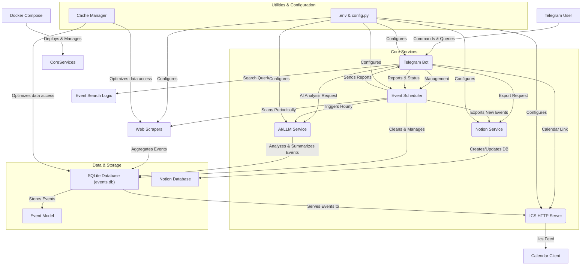

# 🤖 EventFinder Bot: Your Personalized Event Scout 🗓️✨

The EventFinder Bot is a powerful, self-hosted Telegram bot designed to meticulously scan, aggregate, and manage events from diverse sources, providing you with a curated, real-time feed of activities. It combines web scraping, AI analysis, a robust SQLite database, and seamless integration with Notion and ICS calendar feeds to keep you updated on the most relevant happenings.

This project orchestrates three core services:
*   **Telegram Bot**: For interactive, on-demand event search, scanner management, and report generation.
*   **Event Scheduler**: A background service for continuous event aggregation and processing.
*   **HTTP ICS Server**: To provide subscribable calendar feeds, accessible from any calendar application.

## 🚀 Features & Capabilities

The EventFinder Bot is engineered to deliver a comprehensive event discovery experience:

*   **Hourly AI Digest**: Leverages advanced AI (e.g., DeepSeek V3.2, as indicated by `llm_analysis` in `bot.py` and the `AGENTS.md` file) to analyze newly discovered events every hour, generating concise summaries of the most compelling activities.
*   **Automated Scanning**: The event scheduler automatically starts upon application launch, ensuring continuous, up-to-date event data.
*   **Extensive Source Aggregation**: Scans a wide array of event platforms, including:
    *   **Aggregators**: KudaGo, Timepad, Yandex.Afisha.
    *   **Educational Institutions**: Leading universities like HSE, MSU, PRUE, RANEPA, and more.
    *   **IT & Community Platforms**: Habr Events, Telegram (via web previews), VK communities.
    *   **Cultural & Lecture Series**: "Smart Lecture Halls" such as Arzamas, ZIL Cultural Center, Leader-ID.
*   **Persistent Data Storage**: All discovered events are securely stored in a local SQLite database (`data/events.db`).
*   **Dynamic ICS Calendar Feed**: Offers both a general and filterable `.ics` calendar feed, allowing subscription to events in your preferred calendar application (Google Calendar, Outlook, Apple Calendar, etc.).
*   **Notion Database Integration**: Automatically exports newly found events to a structured Notion database, complete with source and topic tags.
*   **Telegram Reporting**: Delivers timely reports and summaries directly to your Telegram chat.
*   **Configurable Data Retention**: Automatically cleans up old events based on a user-defined time-to-live (TTL) setting.
*   **Robust Error Handling**: Includes an `error_handler` (as seen in `bot.py`) for graceful recovery and user notification on unexpected issues.
*   **Smart Message Chunking**: Handles long reports by splitting them into manageable HTML chunks, ensuring all information is delivered within Telegram's message limits.

## 🛠 Technology Stack

The project is built on a modern Python foundation, leveraging powerful libraries and tools:

*   **Core Language**: Python 3.10+
*   **Telegram Bot Framework**: `python-telegram-bot` (v20.7)
*   **Web Scraping**: `requests`, `httpx` (for HTTP requests), `beautifulsoup4` (for HTML parsing)
*   **Database**: SQLite (`data/events.db`), managed with `SQLAlchemy` and `aiosqlite` (for asynchronous operations)
*   **Environment Management**: `python-dotenv`
*   **Date/Time Handling**: `python-dateutil`
*   **Image Processing**: `Pillow` (potentially used by `generate_avatar.py`)
*   **Asynchronous Operations**: `asyncio`
*   **Containerization**: Docker, Docker Compose
*   **Testing**: `pytest`, `pytest-asyncio`
*   **AI/LLM Integration**: Implicit via `llm_analysis` handler and `nvidia_service.py` (suggests potential for GPU-accelerated AI tasks).

## 🏗 Architecture & Workflow

The EventFinder Bot operates as a multi-component system, orchestrated for efficiency and scalability.



### Workflow Breakdown:

1.  **User Interaction**: Telegram users interact with the `Telegram Bot` (`bot.py`) by sending commands or using inline buttons.
2.  **Command Handling**: User input is processed by dedicated `handlers` (e.g., `admin.py`, `search.py`, `menu.py`).
3.  **Event Search**: Manual search requests are handled by `Event Search Logic` (`event_search.py`), which queries the `SQLite Database`.
4.  **Scheduled Scanning**: The `Event Scheduler` (`scheduler.py`) runs in the background, periodically activating `Web Scrapers` to gather events from various sources.
5.  **Data Storage**: Scraped events are normalized and stored in the `SQLite Database` (`database.py`, `models.py`). The database also stores event summaries generated by the `AI/LLM Service`.
6.  **AI Integration**: The `AI/LLM Service` (likely orchestrated via `llm_analysis` handler and potentially leveraging `nvidia_service.py`) analyzes new events, generates summaries, and updates the database. This can be triggered manually via the bot or automatically by the scheduler.
7.  **Notion Export**: The `Notion Service` (`notion_service.py`) handles exporting events, either manually via a bot command or automatically by the scheduler, into a structured Notion database.
8.  **ICS Calendar**: The `ICS HTTP Server` (`ics_server.py`, `calendar_service.py`) dynamically serves event data from the SQLite database as an `.ics` feed, which can be subscribed to by any standard calendar application.
9.  **Configuration**: Environment variables (`.env`) and `config.py` provide crucial settings for all services.
10. **Deployment**: `docker-compose.yml` facilitates easy setup and deployment of all services as containerized applications.

## 📂 Project Structure

The repository is organized for clarity and maintainability:

```
.
├── data/
│   ├── events.db             # Primary SQLite database for storing events
│   ├── events.db-wal         # Write-ahead log for SQLite
│   └── events.db-shm         # Shared memory for SQLite
├── handlers/                 # Contains handlers for various Telegram bot commands and callbacks
│   ├── admin.py              # Admin-specific commands (start/stop scanner, status, reports)
│   ├── menu.py               # Main menu and common button handlers
│   └── search.py             # Handlers for interactive event search
├── tests/                    # Unit and integration tests for various components
│   ├── test_event_finder.py
│   └── ...
├── .github/                  # GitHub Actions workflows for CI/CD
│   └── workflows/
│       └── ci.yml            # Continuous Integration pipeline
├── AGENTS.md                 # Documentation related to AI agents or LLM configurations
├── avatar.png                # Project avatar/logo
├── bot.py                    # The core Telegram bot logic and entry point for bot services
├── cache_manager.py          # Manages caching strategies to optimize performance
├── calendar_service.py       # Logic for generating and serving ICS calendar data
├── config.py                 # Centralized configuration settings for the application
├── CONTEXT.md                # Contextual documentation or notes
├── database.py               # Database interaction layer (CRUD operations, schema management)
├── Dockerfile                # Dockerfile for building the application image
├── docker-compose.yml        # Docker Compose configuration for multi-service deployment
├── .env.example              # Example environment variables file
├── error_handling.py         # Centralized error handling utilities
├── event_search.py           # Core logic for searching and filtering events
├── generate_avatar.py        # Script to generate the project avatar (if dynamic)
├── ics_server.py             # HTTP server implementation for delivering ICS feeds
├── models.py                 # SQLAlchemy models defining the database schema
├── notion_service.py         # Service for interacting with the Notion API
├── nvidia_service.py         # (Inferred) Service for NVIDIA-specific tasks, potentially AI/GPU acceleration
├── references/               # Reference materials or API notes
│   └── api-notes.md
├── requirements.txt          # Python dependencies
├── run.py                    # Main application entry point, initializes and starts services
├── scheduler.py              # Background service for event scanning and automated tasks
├── SKILL.md                  # Documentation on specific skills or capabilities
├── test_compat.py            # (Inferred) Compatibility tests
├── test_output.py            # (Inferred) Tests related to output generation
└── README.md                 # This documentation file
```

## ⚙️ Installation & Quick Start

Get your EventFinder Bot up and running with minimal effort using Docker Compose, or run it locally for development.

### Prerequisites

*   Git
*   Docker and Docker Compose (recommended for production deployment)
*   Python 3.10+ and `pip` (for local development)

### 🐳 Docker Compose (Recommended)

1.  **Clone the repository:**
    ```bash
    git clone https://github.com/iv150320/event_finder_110426_bot.git
    cd event_finder_110426_bot
    ```

2.  **Configure environment variables:**
    Copy the example environment file and fill in your details.
    ```bash
    cp .env.example .env
    ```
    Edit the newly created `.env` file, at minimum providing your `TELEGRAM_BOT_TOKEN`. Optionally, configure Notion API keys or Timepad API keys if you plan to use those integrations.

3.  **Build and run the services:**
    ```bash
    docker compose up -d --build
    ```
    This command will build the Docker images and start all services (Telegram bot, scheduler, ICS server) in detached mode.

### 🐍 Local Development Setup

1.  **Clone the repository:**
    ```bash
    git clone https://github.com/iv150320/event_finder_110426_bot.git
    cd event_finder_110426_bot
    ```

2.  **Set up a virtual environment:**
    ```bash
    python -m venv .venv
    source .venv/bin/activate # On Windows, use `.\.venv\Scripts\activate`
    ```

3.  **Install dependencies:**
    ```bash
    pip install -r requirements.txt
    ```

4.  **Configure environment variables:**
    ```bash
    cp .env.example .env
    ```
    Edit `.env` as described in the Docker setup.

5.  **Run the application:**
    ```bash
    python run.py
    ```
    This will start the bot, scheduler, and ICS server within your local environment.

### Environment Variables

Configure the bot's behavior using the following environment variables in your `.env` file:

| Variable                  | Description                                                                                                                                                                                                                               | Default Value          |
| :------------------------ | :---------------------------------------------------------------------------------------------------------------------------------------------------------------------------------------------------------------------------------------- | :--------------------- |
| `TELEGRAM_BOT_TOKEN`      | **Required.** The authentication token obtained from BotFather for your Telegram bot.                                                                                                                                                       | (None)                 |
| `ALLOWED_USERS`           | Comma-separated list of Telegram user IDs (e.g., `123456789,987654321`). If left empty, all users will have access to the bot. Highly recommended for production to restrict access.                                                       | (None)                 |
| `NOTION_API_KEY`          | Bearer token for Notion API integration. Required for Notion export functionality.                                                                                                                                                        | (None)                 |
| `NOTION_PARENT_PAGE_ID`   | The ID of the Notion page where new event databases or reports will be created. Required for Notion export.                                                                                                                                | (None)                 |
| `TIMEPAD_API_KEY`         | Bearer token for the Timepad API. Optional, but recommended for more comprehensive Timepad event scraping.                                                                                                                                | (None)                 |
| `ICS_HOST`                | The host interface the ICS server will bind to. Use `0.0.0.0` to make it accessible from outside the container/localhost.                                                                                                                | `0.0.0.0`              |
| `ICS_PORT`                | The port on which the ICS HTTP server will listen.                                                                                                                                                                                        | `8081`                 |
| `EXTERNAL_HOST`           | The public-facing host address (e.g., your domain or IP) used to generate links for the ICS feed or other external resources in Telegram messages. If not set, `localhost` will be used.                                                | (None)                 |
| `SCHEDULER_CITIES`        | Comma-separated list of city slugs for which the scheduler will automatically scan events.                                                                                                                                                | `msk`                  |
| `SCHEDULER_CLEANUP_DAYS`  | The number of days after which old events will be automatically removed from the database by the scheduler. Set to `0` to disable cleanup.                                                                                                | `60`                   |

**Available City Slugs**: `msk` (Moscow), `spb` (St. Petersburg), `ekb` (Ekaterinburg), `nsk` (Novosibirsk), `kzn` (Kazan), `sochi`, `smr` (Samara), `krd` (Krasnodar), `ufa`, `nnv` (Nizhny Novgorod), `krasnoyarsk`.

## 💬 Commands & Buttons

Interact with the EventFinder Bot through a user-friendly interface:

*   `▶️ Запустить поиск` (Start Scanner): Initiates the background event scheduler if it is currently stopped.
*   `⏹ Остановить` (Stop Scanner): Halts the background event scheduler.
*   `📊 Статус` (Status): Displays the current operational status of the scheduler and provides a summary of event sources.
*   `📋 Отчёт` (Report): Generates and sends a report of up to 30 new events, marking them as processed.
*   `📤 Notion` (Notion Export): Exports up to 100 new events to your configured Notion database. If no new events are available, it exports recent records without resetting their `is_new` status.
*   `📅 Календарь` (Calendar): Provides a direct link to your personalized `.ics` calendar feed.
*   `🔍 Найти мероприятия` (Find Events): Initiates an interactive search dialogue, allowing you to specify a topic, city, and time period for events (with a 30-second cooldown per search).
*   `🎓 Вузы` (Universities): Allows you to search for events specifically from a selected university.
*   `/cancel`: Terminates any ongoing interactive dialogue (e.g., event search, university selection).

## 📅 ICS Calendar Integration

Subscribe to your event feeds directly from your preferred calendar application.

**Main Feed URL Structure:**
```text
http://<EXTERNAL_HOST>:<ICS_PORT>/events.ics
```
Replace `<EXTERNAL_HOST>` with your bot's public IP or domain and `<ICS_PORT>` with your configured ICS server port.

**Filter Options (via URL parameters):**
You can filter the ICS feed by `topic` or `source`. Multiple topics/sources can be specified by repeating the parameter.

*   **By Topic**:
    *   `?topic=бизнес` (Business)
    *   `?topic=IT`
    *   `?topic=AI`
    *   `?topic=экономика` (Economics)
    *   `?topic=политика` (Politics)
    *   `?topic=история` (History)
    *   `?topic=английский язык` (English Language)
    *   `?topic=психология` (Psychology)
    *   `?topic=литература` (Literature)
*   **By Source**:
    *   `?source=ВШЭ` (HSE)

**Calendar Export Specifics:**

*   **All-Day Events**: Events without a specified time are exported as all-day events.
*   **Timezone Handling**: Events with specific times are exported in the `Europe/Moscow` timezone.
*   **Future Events Only**: The ICS feed only includes events scheduled for the future. Past events are automatically excluded.

## 📝 Notion Integration

The EventFinder Bot offers both automated and manual export options to Notion, providing flexible event management.

### 1. Automated Export

*   Upon the initial run, the scheduler automatically creates a dedicated database within your specified Notion `NOTION_PARENT_PAGE_ID`.
*   Subsequently, during each scanning cycle, only *new* events discovered in that cycle are added to this Notion database.
*   The "Source" and "Topic" fields are intelligently handled using `rich_text` types, meaning you don't need to pre-create `select` options in Notion. The bot will automatically add new sources/topics as text.
*   Export operations are throttled to respect Notion API limits: 0.4 seconds between row insertions and a 1-second pause after every 20 rows.

### 2. Manual Export

*   Using the `📤 Notion` button in Telegram, you can manually trigger an export.
*   This action creates a separate report page in Notion, structured with tables categorized by event sources. This is ideal for one-off reports or summaries.